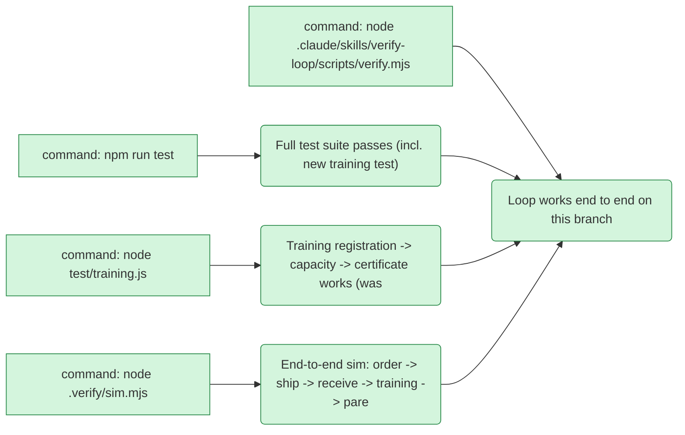

```mermaid
flowchart LR
  e_tests["command: npm run test"]:::ok
  e_training["command: node test/training.js"]:::ok
  e_sim["command: node .verify/sim.mjs"]:::ok
  e_gate["command: node .claude/skills/verify-loop/scripts/verify.mjs"]:::ok
  c_tests("Full test suite passes (incl. new training test)"):::ok
  c_training("Training registration -> capacity -> certificate works (was "):::ok
  c_sim("End-to-end sim: order -> ship -> receive -> training -> pare"):::ok
  c_done("Loop works end to end on this branch"):::ok
  e_tests --> c_tests
  e_training --> c_training
  e_sim --> c_sim
  e_gate --> c_done
  c_tests --> c_done
  c_training --> c_done
  c_sim --> c_done
  classDef ok fill:#d4f5dd,stroke:#2a8a4a
  classDef bad fill:#fbd5d5,stroke:#c0392b
```
