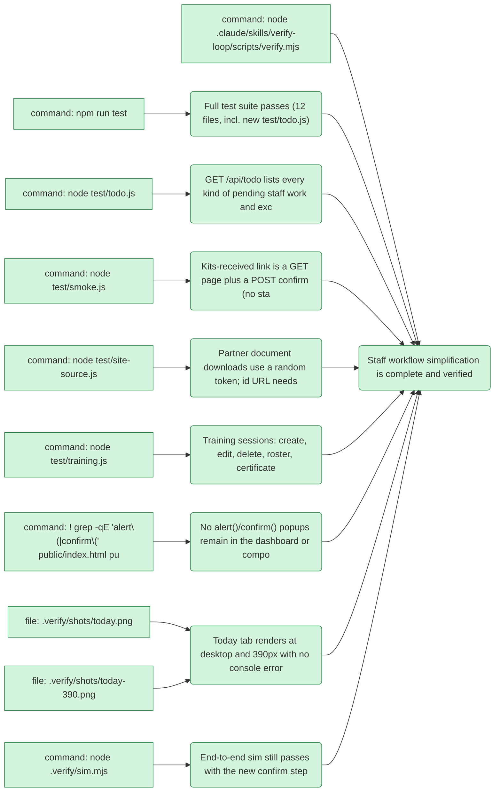

```mermaid
flowchart LR
  e_tests["command: npm run test"]:::ok
  e_todo["command: node test/todo.js"]:::ok
  e_smoke["command: node test/smoke.js"]:::ok
  e_site["command: node test/site-source.js"]:::ok
  e_training["command: node test/training.js"]:::ok
  e_noalert["command: ! grep -qE 'alert\(|confirm\(' public/index.html pu"]:::ok
  e_shot["file: .verify/shots/today.png"]:::ok
  e_shot390["file: .verify/shots/today-390.png"]:::ok
  e_sim["command: node .verify/sim.mjs"]:::ok
  e_gate["command: node .claude/skills/verify-loop/scripts/verify.mjs"]:::ok
  c_tests("Full test suite passes (12 files, incl. new test/todo.js)"):::ok
  c_todo("GET /api/todo lists every kind of pending staff work and exc"):::ok
  c_received("Kits-received link is a GET page plus a POST confirm (no sta"):::ok
  c_docs("Partner document downloads use a random token; id URL needs "):::ok
  c_training("Training sessions: create, edit, delete, roster, certificate"):::ok
  c_noalert("No alert()/confirm() popups remain in the dashboard or compo"):::ok
  c_shots("Today tab renders at desktop and 390px with no console error"):::ok
  c_sim("End-to-end sim still passes with the new confirm step"):::ok
  c_done("Staff workflow simplification is complete and verified"):::ok
  e_tests --> c_tests
  e_todo --> c_todo
  e_smoke --> c_received
  e_site --> c_docs
  e_training --> c_training
  e_noalert --> c_noalert
  e_shot --> c_shots
  e_shot390 --> c_shots
  e_sim --> c_sim
  e_gate --> c_done
  c_tests --> c_done
  c_todo --> c_done
  c_received --> c_done
  c_docs --> c_done
  c_training --> c_done
  c_noalert --> c_done
  c_shots --> c_done
  c_sim --> c_done
  classDef ok fill:#d4f5dd,stroke:#2a8a4a
  classDef bad fill:#fbd5d5,stroke:#c0392b
```
